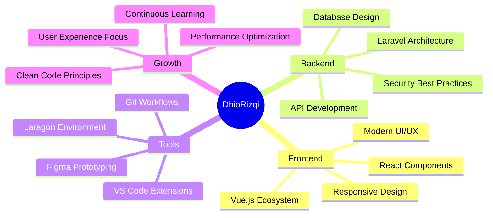

<div align="center">


</div>

<div align="center">
  
[](https://git.io/typing-svg)

</div>

---


### 👨‍💻 About Me

```typescript
interface Developer {
  name: string;
  location: string;
  role: string;
  languages: string[];
  frameworks: string[];
  tools: string[];
  currentFocus: string[];
  motto: string;
}

const dhio: Developer = {
  name: "DhioRizqi",
  location: "Surabaya, Indonesia 🇮🇩",
  role: "Full Stack Web Developer",
  languages: ["PHP", "JavaScript", "SQL"],
  frameworks: ["Laravel", "Vue.js", "React"],
  tools: ["VS Code", "Figma", "Laragon", "Git"],
  currentFocus: ["Laravel Ecosystem", "Modern UI/UX"],
  motto: "Code with purpose, design with passion ✨"
};
```

<br clear="both">

---

## 🛠️ Tech Arsenal

<div align="center">

<table>
<tr>
<td align="center" width="96">

<br><strong>Laravel</strong>
</td>
<td align="center" width="96">

<br><strong>Vue.js</strong>
</td>
<td align="center" width="96">

<br><strong>React</strong>
</td>
<td align="center" width="96">

<br><strong>PHP</strong>
</td>
<td align="center" width="96">

<br><strong>JavaScript</strong>
</td>
<td align="center" width="96">

<br><strong>MySQL</strong>
</td>
</tr>
<tr>
<td align="center" width="96">

<br><strong>HTML5</strong>
</td>
<td align="center" width="96">

<br><strong>CSS3</strong>
</td>
<td align="center" width="96">

<br><strong>Figma</strong>
</td>
<td align="center" width="96">

<br><strong>VS Code</strong>
</td>
<td align="center" width="96">

<br><strong>Git</strong>
</td>
<td align="center" width="96">

<br><strong>Bootstrap</strong>
</td>
</tr>
</table>

</div>

---

## 📊 GitHub Analytics

<div align="center">
  
  
</div>

<div align="center">
  
</div>

<div align="center">
  
</div>

---

## 🚀 Featured Projects

<div align="center">

### 🎯 Project Showcase

<table>
<tr>
<td width="50%">

#### 🎓 [Belajarin](https://github.com/DhioRizqi/belajarin-website)
*Online Learning Platform*

```
📚 Interactive course management
👥 User authentication & profiles  
📊 Progress tracking system
📱 Responsive design
```

**Tech:** `Laravel` `Vue.js` `MySQL`

</td>
<td width="50%">

#### 🧽 [CuciKin](https://github.com/DhioRizqi/CuciKin)
*Laundry Management System*

```
🔄 Order processing workflow
👤 Customer dashboard
📋 Service tracking
💳 Payment integration ready
```

**Tech:** `Laravel` `PHP` `Bootstrap`

</td>
</tr>
<tr>
<td width="50%">

#### 💼 [Personal Portfolio](https://github.com/DhioRizqi/Portofolio-Html-Css-Js)
*Interactive Portfolio*

```
✨ Smooth animations
📱 Fully responsive
🎨 Modern UI design
📞 Contact integration
```

**Tech:** `HTML5` `CSS3` `JavaScript`

</td>
<td width="50%">

#### 💝 [Camelia Love](https://github.com/DhioRizqi/camelia-love)
*Creative Digital Experience*

```
🎨 Interactive elements
💫 Custom animations
🎭 Creative coding
💕 Emotional design
```

**Tech:** `HTML` `CSS` `JavaScript`

</td>
</tr>
</table>

</div>

---

<div align="center">

## 💭 Development Philosophy

> *"Great software is built not just with code, but with empathy for the user, passion for problem-solving, and commitment to continuous learning."*

</div>

<div align="center">

### 🎯 What Drives Me



</div>

---

## 🌐 Let's Connect & Collaborate

<div align="center">

<a href="https://linkedin.com/in/yourprofile" target="_blank">

</a>
<a href="mailto:your.email@gmail.com" target="_blank">

</a>
<a href="https://github.com/DhioRizqi" target="_blank">

</a>
<a href="https://yourportfolio.com" target="_blank">

</a>

<br><br>


### 🎵 Currently Coding To
[](https://github.com/kittinan/spotify-github-profile)

</div>

---

<div align="center">


**⭐ If you find my projects interesting, don't forget to star them! ⭐**

*"Code is poetry written in logic"* 

</div>
